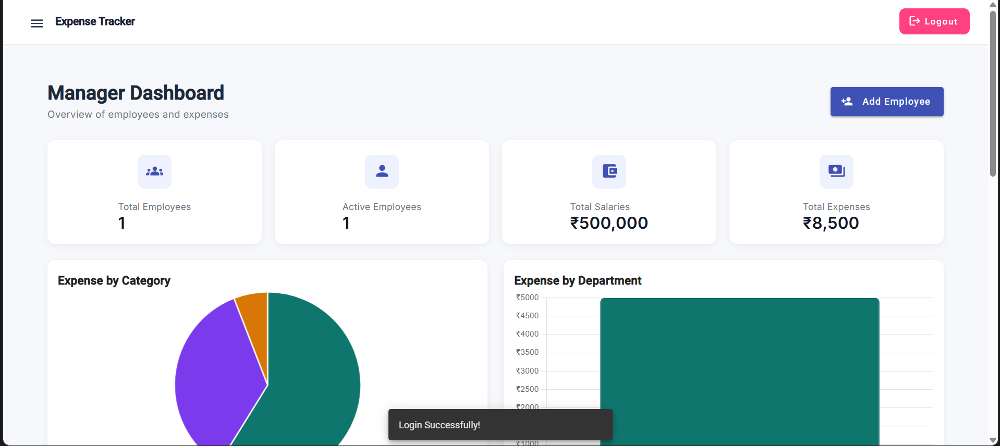
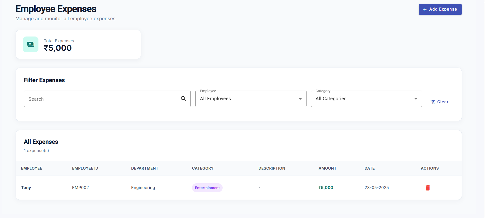
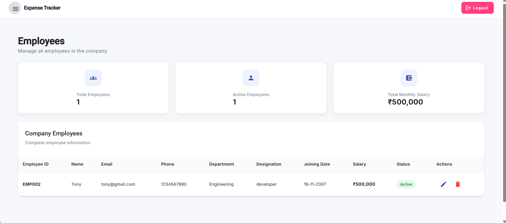
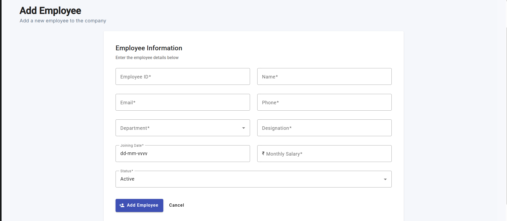
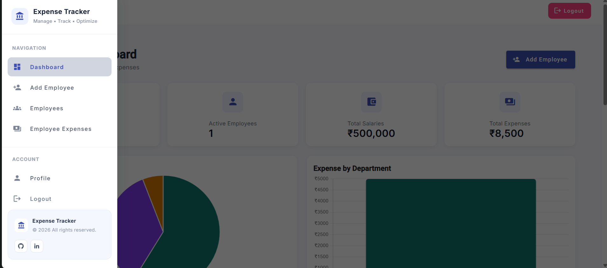
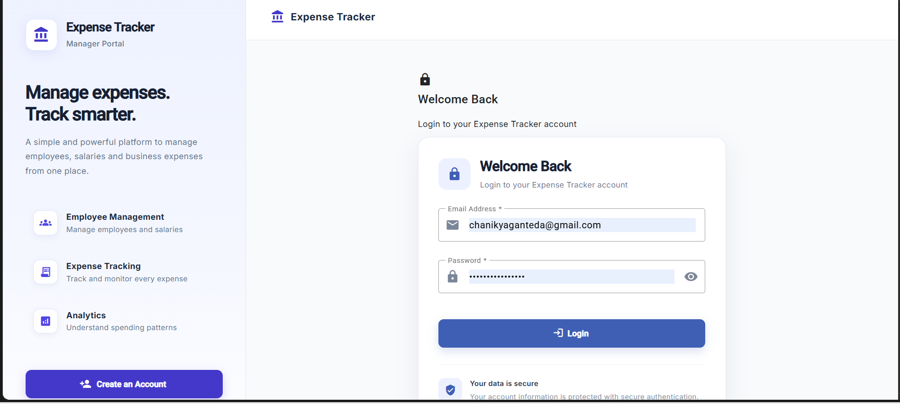

# Employee Expense Tracker

<p align="center">⚡ <strong>Built with Angular, TypeScript, Node.js, Express, MongoDB, Mongoose, Bootstrap, Angular Material, Chart.js, and JWT</strong></p>

Employee Expense Tracker is a full-stack web application for recording, organizing, and reviewing employee expenses in one place. Built with Angular and Node.js, it provides a clear dashboard for managing employees, expenses, categories, and spending insights.

## Features

<table>
  <tr>
    <td width="50%" align="center">
      
      <h3>Dashboard Overview</h3>
      <p>View an at-a-glance summary of expenses and key business data.</p>
    </td>
    <td width="50%" align="center">
      
      <h3>Expense Management</h3>
      <p>Add, view, and organize expense records with ease.</p>
    </td>
  </tr>
  <tr>
    <td width="50%" align="center">
      
      <h3>Employee Management</h3>
      <p>Maintain employee details and review employee-specific expenses.</p>
    </td>
    <td width="50%" align="center">
      
      <h3>Add Employees</h3>
      <p>Add employee information quickly from a dedicated form.</p>
    </td>
  </tr>
  <tr>
    <td width="50%" align="center">
      
      <h3>Easy Navigation</h3>
      <p>Move between dashboard, employee, and expense views using the sidebar.</p>
    </td>
    <td width="50%" align="center">
      
      <h3>Secure Access</h3>
      <p>Use sign-up and login flows to keep the application accessible to authorized users.</p>
    </td>
  </tr>
</table>

> Screenshots are stored in the `Screenshots` folder and displayed above in the feature grid.

## Technologies Used

### Frontend

- **Angular 15** — application framework
- **TypeScript** and **SCSS** — application logic and styling
- **Angular Material** and **Bootstrap** — responsive user-interface components
- **Chart.js** with **ng2-charts** — charts and expense visualizations

### Backend

- **Node.js** and **Express.js** — REST API server
- **MongoDB Atlas** and **Mongoose** — cloud database and object modeling
- **JWT** and **bcryptjs** — authentication and password hashing
- **dotenv** — local environment-variable management

## Run the Project Locally

### Prerequisites

Install the following before starting:

- [Node.js](https://nodejs.org/) (LTS version recommended)
- npm (installed with Node.js)
- A MongoDB Atlas database and database-user password

### 1. Clone the repository

```bash
git clone https://github.com/chanikya2006/Employee-Expense-Tracker.git
cd Employee-Expense-Tracker
```

### 2. Install dependencies

Install the project packages from the repository root:

```bash
npm install
```

### 3. Configure environment variables

Create a `.env` file in the project root. Do not commit this file because it contains private credentials.

```env
MONGO_ATLAS_PW=your_mongodb_atlas_password
JWT_KEY=your_long_random_secret_key
PORT=3000
```

> The backend connection string is defined in `backend/app.js`. Ensure the MongoDB Atlas user, cluster, and database name in that file match your own MongoDB Atlas setup.

### 4. Start the backend server

Open a terminal in the project root and run:

```bash
npm run start:server
```

The API runs at `http://localhost:3000` by default.

### 5. Start the Angular frontend

Open a second terminal in the same project folder and run:

```bash
npm start
```

Then open `http://localhost:4200` in your browser.

### 6. Verify the connection

The development frontend is configured to call `http://localhost:3000/v1/api/`. Keep both the backend and frontend terminals running while using the application.
